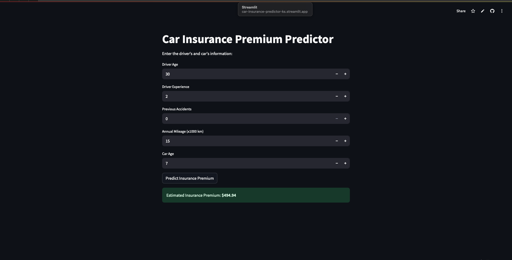

# 🚗 Car Insurance Premium Predictor

Predict car insurance premiums for new or existing drivers using machine learning.  
This project features a ready-to-use web app built with Streamlit that provides instant predictions based on user input.

---

## ✨ Features

- Predicts insurance premiums using driver and vehicle info
- User-friendly web interface (Streamlit)
- Trained on real (or realistic) car insurance data
- Fast, accurate, and interpretable model (Linear Regression)
- Ready to deploy for public use—no retraining required

---

## 🚀 Live Demo

> [Try the App Live on Streamlit Cloud](#)
> https://car-insurance-predictor-ks.streamlit.app


---

## 📊 Example Screenshot

  


---

## 🏗️ Project Structure

```plaintext
car-insurance-predictor/
│
├── app/
│   └── streamlit_app.py            # Web app source code
│   └── assets/                     # Images, demo screenshots, etc.
├── data/
│   └── raw/                        # Original dataset (not required for web app)
├── models/
│   └── car_insurance_linreg.pkl    # Trained ML model
│   └── feature_cols.pkl            # List of feature names
├── src/
│   └── train_model.py              # Model training script
│   └── predict.py                  # Model loading & prediction script
├── requirements.txt                # Python dependencies
├── README.md                       # Project documentation
└── .gitignore
